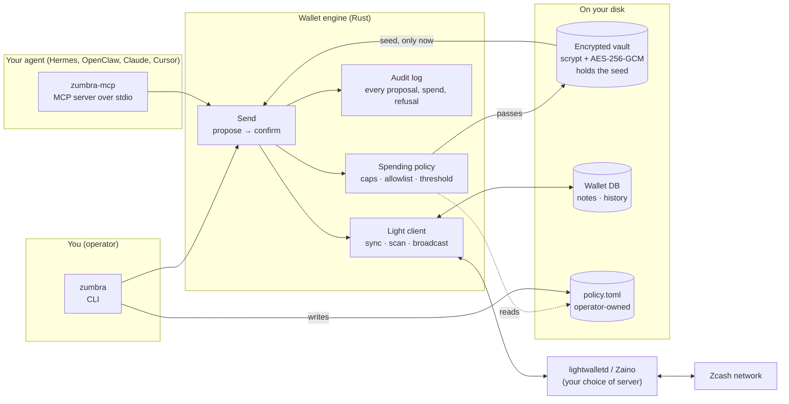
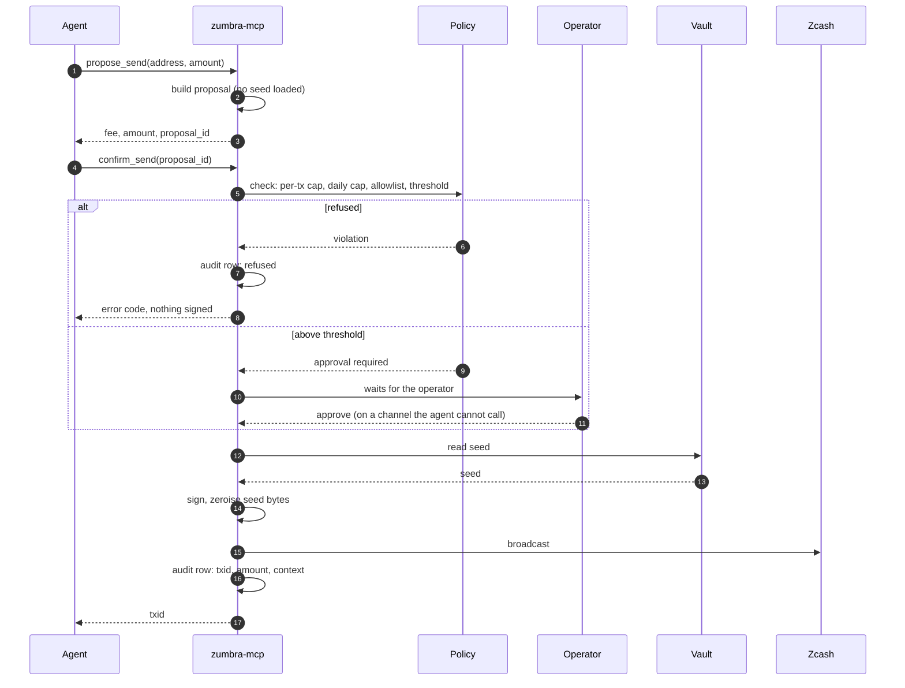

# How Zumbra works

Two ways in, one engine, one wallet on disk. Nothing leaves the machine except light-client
traffic to a Zcash server you choose.

## The pieces

- The agent and the operator use the same engine. The difference is what each is allowed to
  touch: the agent can propose and confirm; only the operator writes the policy.
- The seed is read from the vault only after the policy has passed, and only for the signing
  step. It is zeroised from memory afterwards.
- The audit log is local SQLite. The daily cap is computed from it, not from memory, so a
  restart cannot reset it.

## How a send works

The order is the whole design: propose, policy, approve, sign. The seed is the last thing
touched, never the first.

## What the agent can and cannot do

| Can | Cannot |
|---|---|
| read balance, addresses, history, sync state | read or change the policy file |
| propose a send and confirm it within the policy | approve its own above-threshold send |
| shield transparent funds | unlock a locked wallet |
| pay an x402 paywall within the policy | export, print or see the seed |

## Where things live

| Path | What |
|---|---|
| `~/.zumbra/<network>/` | wallet database, audit log, pending proposal, policy |
| `~/.ows/wallets/<name>.json` | the encrypted vault with the seed |
| `policy.toml` | per-tx cap, daily cap, allowlist, approval threshold, in zatoshi |

Testnet and mainnet are separate directories and separate vault wallets. Start on testnet.
